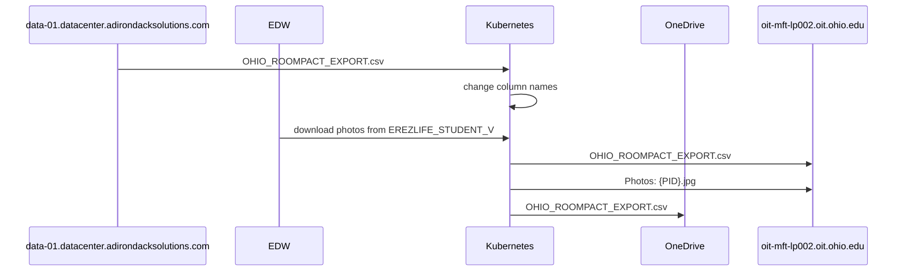

## Sequence Diagram

---
## Patch Testing Instructions
To verify the patching did not break the integration follow the steps below:

1. Run the integration using the old version of Python.
2. Locate the `OHIO_ROOMPACT_EXPORT_{date}_{time}.csv` file in the SET OneDrive by navigating to `{env}/roompact-integration/archive/Combined`.
3. Repeat steps 1-2 with the new version of Python.
Use the command diff <(sort {file1}) <(sort {file2}) to ensure that the file contents are identical on the same data.
4. Ensure that the new version of the integration successfully uploaded the photos to the OHIO SFTP server. Non-prod runs will upload photos in the `test/studentphotos` dir of the OHIO SFTP.
TEST CHANGE