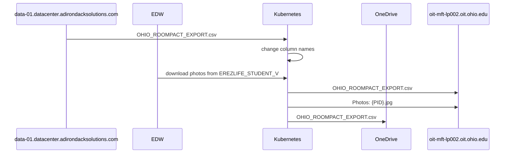

## Sequence Diagram

```mermaid
sequenceDiagram
    participant adirondack as data-01.datacenter.adirondacksolutions.com
    participant edw as EDW
    participant k8s as Kubernetes
    participant OD as OneDrive
    participant ohio as oit-mft-lp002.oit.ohio.edu

    adirondack ->> k8s: OHIO_ROOMPACT_EXPORT.csv
    k8s ->> k8s: change column names
    edw ->> k8s: download photos from EREZLIFE_STUDENT_V
    k8s ->> ohio: OHIO_ROOMPACT_EXPORT.csv
    k8s ->> ohio: Photos: {PID}.jpg 
    k8s ->> OD: OHIO_ROOMPACT_EXPORT.csv
```

---
## Patch Testing Instructions
TEST CHANGE
